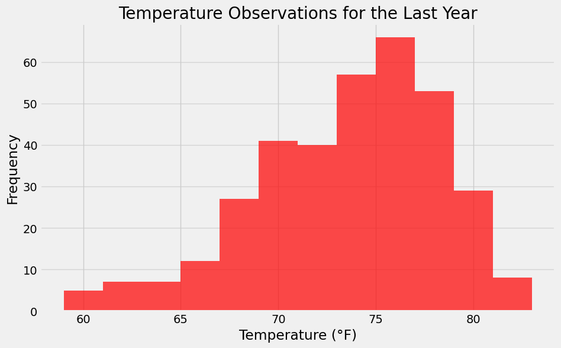

# Weather Data Flask API

## Overview

This project creates a RESTful API using **Flask** and **SQLAlchemy** to serve historical climate data for Hawaii. The data is pulled from a SQLite database (`hawaii.sqlite`) and includes precipitation, temperature observations, and station information collected over several years. This project demonstrates core backend development techniques including ORM table reflection, API route handling, and dynamic querying based on user input via URL parameters.

---

## About This Repository

A Flask-based backend application that queries a SQLite weather database using SQLAlchemy ORM and serves multiple API endpoints for climate analysis.

---

## Data Sources

All datasets are contained in the `Resources/` folder:

- `hawaii.sqlite`: SQLite database containing historical climate and station data
- `hawaii_stations.csv`: Station information
- `hawaii-measurements.csv`: Daily weather observations

---

## Technologies Used

- Python 3.12.4
- Flask
- SQLAlchemy ORM
- SQLite
- Jupyter Notebook (for initial analysis)
- Pandas / Matplotlib (exploratory analysis)
- VS Code

---

## Project Files

| File / Folder                    | Description                                                       |
|----------------------------------|-------------------------------------------------------------------|
| `app.py`                         | Flask app that builds and runs the API                            |
| `climate_analysis.ipynb`         | Jupyter notebook for data reflection and EDA                      |
| `Resources/hawaii.sqlite`        | SQLite DB used by SQLAlchemy                                      |
| `Resources/hawaii_stations.csv` | Station data (raw CSV)                                            |
| `Resources/hawaii-measurements.csv` | Climate data (raw CSV)                                        |

---
## Live Flask App Preview

This project runs a local Flask server to serve Hawaii climate data through various API endpoints.


---

## API Endpoints

All endpoints return results in JSON format. To start the server, run:

```bash
python app.py
```

Once running, access the API at: `http://127.0.0.1:5000/`

### Root Route `/`

Provides a list of available endpoints.

### `/api/v1.0/precipitation`

Returns a dictionary of precipitation data for the last 12 months:
```json
{
  "2016-08-23": 0.45,
  "2016-08-24": 0.08,
  ...
}
```
  ## API Response – Precipitation Endpoint

  Here’s a sample output from the `/api/v1.0/precipitation` route, returned in clean JSON format.

  

### `/api/v1.0/stations`

Returns a list of all weather stations and their names:
```json
[
  {"USC00519397": "WAIKIKI 717.2, HI US"},
  {"USC00513117": "KANEOHE 838.1, HI US"},
  ...
]
```

### `/api/v1.0/tobs`

Returns daily temperature observations (`tobs`) for the most active station from the last 12 months:
```json
[
  {"2016-08-23": 77.0},
  {"2016-08-24": 80.0},
  ...
]
```

### `/api/v1.0/<start>`

Returns minimum, average, and maximum temperature from the start date to the end of dataset:
```json
{
  "TMIN": 65.0,
  "TAVG": 74.3,
  "TMAX": 85.0
}
```

### `/api/v1.0/<start>/<end>`

Returns temperature stats from a given start date to end date:
```json
{
  "TMIN": 67.0,
  "TAVG": 73.6,
  "TMAX": 84.0
}
```

---

## Skills Demonstrated

- **SQLAlchemy ORM Reflection**: Dynamically mapped existing database tables without needing to define table schemas.
- **RESTful API Design**: Created structured, versioned API endpoints.
- **Dynamic Queries**: Enabled users to query climate data by providing a start or start/end date range.
- **Data Cleaning & Visualization**: Used Pandas and Matplotlib to explore and visualize climate trends in a separate analysis notebook.
- **Separation of Concerns**: Split the Flask backend (`app.py`) from the data exploration (`climate_analysis.ipynb`) for better modularity.

---

## Example Visualizations

Exploratory plots generated in `climate_analysis.ipynb`:

- Precipitation over time:
  

- Temperature histogram:
  

---

## License

This project is licensed under the MIT License.

## Acknowledgments

Project developed as part of a data analytics bootcamp. Thanks to [ChatGPT](https://openai.com/chatgpt) for help brainstorming and editing this README.
